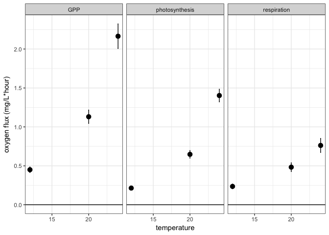
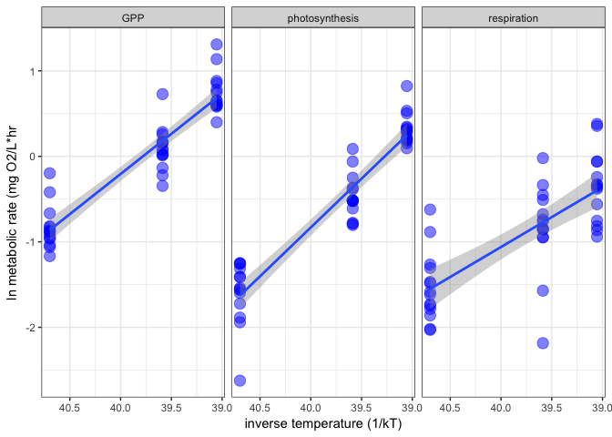
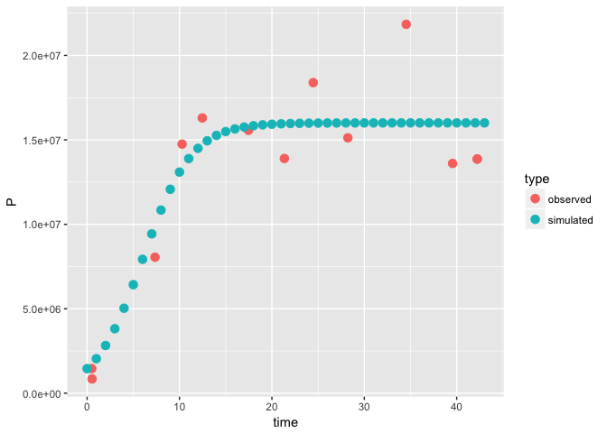
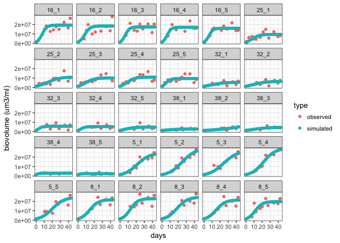
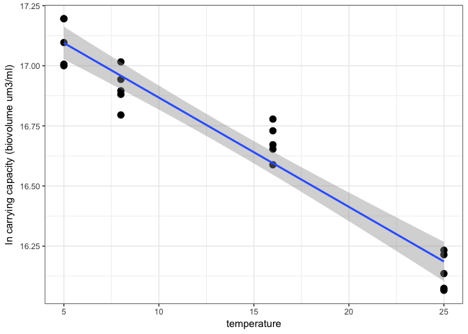
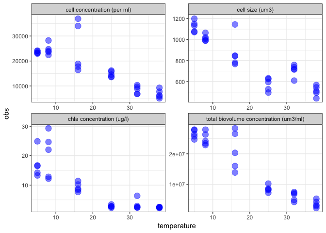
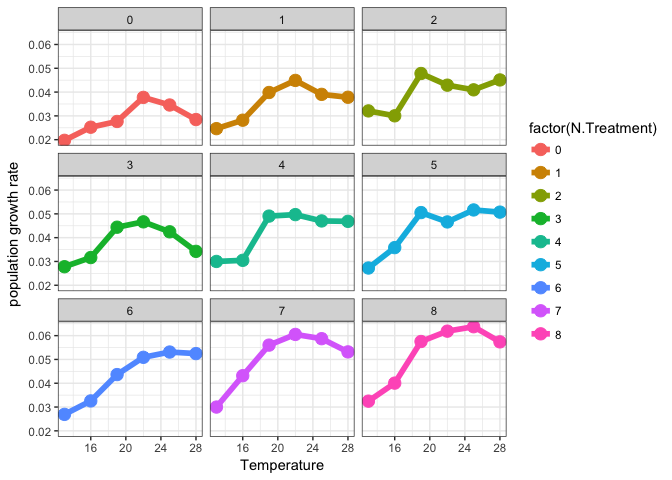
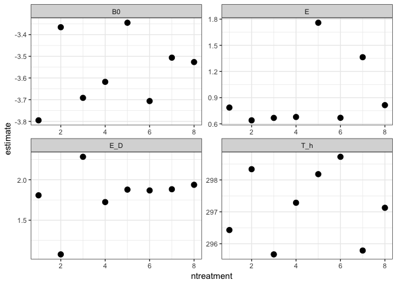

# carrying capacity analysis for Tetraselmis tetrahele


### Background

#### We asked

_How does carrying capacity vary with temperature?_

####  We predicted

* Carrying capacity should decrease with warming, due to higher metabolic demands. As such, the temperature depence of carrying capacity should vary inversely with the temperature dependence of photosynthesis (e.g. Ea = 0.32 eV), which limits metabolism in autotrophs. 

#### Our goals for now:

* estimate r and K by fitting a logistic growth model to our experimental data

* estimate the temperature dependence of K (i.e. Ea of K)

* estimate the activation energies of photosynthesis and respiration in T. Tetrahelis


### Estimate activation energies for photosynthesis and respiration

Read in metabolic rate

*Note! these are practice respirometry data from Scenesdesmus obliquus...I expect the T. Tetrahelis data to look a little different*


```r
metabolic_rate_data <- read_csv("/Users/Joey/Documents/J-TEMP/data-raw/scenedesmus_photo_resp_rates.csv")

metabolic_rate_data %>%
	gather(key = flux_type, value = rate_estimate, GPP, contains("corrected")) %>% 
	mutate(rate_estimate = rate_estimate * 3600) %>% 
	group_by(temperature.x, flux_type) %>% 
	summarise_each(funs(mean, std.error), rate_estimate) %>%
	mutate(mean = ifelse(grepl("respiration", flux_type), mean*-1, mean)) %>%
	mutate(flux_type = ifelse(grepl("corrected_respiration_slope", flux_type), "respiration", flux_type)) %>% 
	mutate(flux_type = ifelse(grepl("corrected_photosynthesis_slope", flux_type), "photosynthesis", flux_type)) %>%
	# mutate(mean = ifelse(grepl("respiration", flux_type), mean*-1, mean)) %>% 
	ggplot(aes(x = temperature.x, y = mean)) + geom_point(size = 3) +
	facet_wrap( ~ flux_type) + geom_errorbar(aes(ymin = mean - std.error, ymax = mean + std.error), width = 0.1) +
	xlab("temperature") +
	ylab("oxygen flux (mg/L*hour)") + geom_hline(yintercept = 0) + theme_bw() 
```

<!-- -->

Plots to get activation energies
<!-- -->

Estimate activation energies

|   flux_type    |     term     | estimate | std.error | statistic | p.value | conf.low | conf.high |
|:--------------:|:------------:|:--------:|:---------:|:---------:|:-------:|:--------:|:---------:|
|      GPP       | inverse_temp |  -0.94   |   0.06    |  -16.28   |    0    |  -1.06   |   -0.82   |
| photosynthesis | inverse_temp |  -1.14   |   0.07    |  -17.42   |    0    |  -1.27   |   -1.01   |
|  respiration   | inverse_temp |  -0.70   |   0.10    |   -6.93   |    0    |  -0.91   |   -0.50   |


Read in time series population dynamics data

```r
sea <- read_csv("/Users/Joey/Documents/J-TEMP/data-processed/sea_processed.csv")
all_cells_TT <-	sea %>%
	filter(species == "TT") %>% 
	unite(Unique_ID, temperature, rep, remove = FALSE) %>%  
	rename(replicate = rep) %>% 
	rename(P = total_biovolume,
				 days = time_since_innoc_days,
				 ID = Unique_ID) %>% 
	arrange(ID, days) %>% 
	filter(!grepl("NA", ID)) 
```

### Define models

Define our logisitic growth model

```r
Parameters <- c(r = 1, K = 10 ^ 7) ## initial parameter guesses
CRmodel <- new("odeModel",
							 main = function (time, init, parms) {
							 	with(as.list(c(init, parms)), {
							 		dp <-  r * P * (1 - (P / K))
							 		list(c(dp))
							 	})
							 },
							 parms = Parameters,
							 times = c(from = 0, to = 43, by = 0.1), # the time interval over which the model will be simulated.
							 init = c(P = 971410.2), # starting biovolume
							 solver = "lsoda" #lsoda will be called with tolerances of 1e-9. Default tolerances are both 1e-6. Lower is more accurate.
)

fittedparms <- c("r", "K") # for assigning fitted parameter values to fittedCRmodel

controlfit <- function(data){
	
	init(CRmodel) <- c(P = data$P[1]) # Set initial model conditions to the biovolume taken from the first measurement day
	obstime <- data$days # The X values of the observed data points we are fitting our model to
	yobs <- select(data, P) # The Y values of the observed data points we are fitting our model to
	
	
	fittedCRmodel <- fitOdeModel(CRmodel, whichpar = fittedparms, obstime, yobs,
															 debuglevel = 0, fn = ssqOdeModel,
															 method = "PORT", lower = LowerBound, upper = UpperBound, scale.par = ParamScaling,
															 control = list(trace = T)
	)
	
	r <- coef(fittedCRmodel)[1]
	K <- coef(fittedCRmodel)[2]
	ID <- data$ID[1]
	output <- data.frame(ID, r, K)
	return(output)
}
```

Define the function that we will use for generating our model fit plots


```r
plotsinglefit <- function(data){
	
	init(CRmodel) <- c(P = data$P[1]) # Set initial model conditions to the biovolume taken from the first measurement day
	obstime <- data$days # The X values of the observed data points we are fitting our model to
	yobs <- select(data, P) # The Y values of the observed data points we are fitting our model to
	# parms(CRmodel)[TempName] <- data$temp[1] # Set the temperature parameter in CRmodel to whatever our control replicate used.
	
	# Below we fit a CRmodel to the replicate's data. The optimization criterion used here is the minimization of the sum of
	# squared differences between the experimental data and our modelled data. 
	
	# The PORT algorithm is used for the model fitting, analogous to O'Connor et al.
	# "lower" is a vector containing the lower bound constraints
	# for the parameter values.
	
	fittedCRmodel <- fitOdeModel(CRmodel, whichpar = fittedparms, obstime, yobs,
															 debuglevel = 0, fn = ssqOdeModel,
															 method = "PORT", lower = LowerBound, upper = UpperBound, scale.par = ParamScaling,
															 control = list(trace = T)
	)
	
	# To display the fitted results we need to create a new OdeModel object. Here
	# we duplicate CRmodel and then alter it to use our new fitted parameters.
	plotfittedCRmodel <- CRmodel
	parms(plotfittedCRmodel)[fittedparms] <- coef(fittedCRmodel)
	
	# set model parameters to fitted values and simulate again
	times(plotfittedCRmodel) <- c(from=0, to=43, by=1)
	ysim <- out(sim(plotfittedCRmodel, rtol = 1e-9, atol = 1e-9))
	
	# Form observed data into a dataframe; the simulated data are already in a dataframe
	observeddata <- data.frame(obstime, yobs)
	observeddata$type <- "observed"
	observeddata <- rename(observeddata, time = obstime)
	simulateddata <- ysim
	simulateddata$type <- "simulated"
output <- bind_rows(observeddata, simulateddata) ## plop everything together into one data frame
	

	# Alternative: Plot the results of our model fitting directly.
	# biol_plot <- ggplot() +
	# 	geom_point(data = observeddata, aes(x = obstime, y = yobs, color = "observed")) + # Observed data are points
	# 	geom_line(data = simulateddata, aes(x = time, y = P, color = "simulated")) + # Simulated data are in a continuous line
	# 	labs(x = "Time (days)", y = "Algal Biovolume")
	
	# Output the results as a ggplot2 object
	# output <- biol_plot
	return(output)
}
```

### Fitting process

Set upper and lower bounds and initial guesses for our parameters

```r
Parameters <- c(r = 1, K = 10 ^ 7)

# Declare the parameters to be used as the bounds for the fitting algorithm
LowerBound <- c(r = 0.01, K = 10 ^ 2)
UpperBound <- c(r = 10, K = 10 ^ 9) 

# Declare the "step size" for the PORT algorithm. 1 / UpperBound is recommended
# by the simecol documentation.
ParamScaling <- 1 / UpperBound
```

Onto the actual fitting! The output_TT will be a dataframe with all of our estimated r and Ks.

```r
#Going to cheat here and not run this here. Since it'll take a while! But I'm including it so we can see it.

TT_split <- split(all_cells_TT, f = all_cells_TT$ID) ## split the TT dataframe into little mini dataframes, one for each replicate - temperature combination. We will then use a map function to apply our fitting function to each dataframe individually.

output_TT <- TT_split %>% 
	map_df(controlfit)

write_csv(output_TT, "/Users/Joey/Documents/J-TEMP/data-processed/output_rK_TT.csv")
```


### Plot the model fits

```r
obs_sim_data <- TT_split %>% 
	map_df(plotsinglefit, .id = "ID") ## don't run this here

obs_sim_data %>% 
	separate(ID, into = c("temperature", "rep"), remove = FALSE) %>% 
	mutate(temperature = as.numeric(temperature)) %>% 
	mutate(type = str_replace(type, "simulated", "fit"))

write_csv(obs_sim_data, "/Users/Joey/Documents/J-TEMP/data-processed/TT_obs_sim_data.csv")
```


Plot the observed and simulated data, based on our fitted parameters to see how they match up

```r
obs_sim_data <- read_csv("/Users/Joey/Documents/J-TEMP/data-processed/TT_obs_sim_data.csv")

obs_sim_data %>% 
	filter(ID == "16_5") %>% 
	ggplot(aes(x = time, y = P, color = type)) + geom_point(size = 3)
```

<!-- -->

```r
ggplot() +
	geom_point(data = obs_sim_data, aes(x = time, y = P, color = type)) + 
	facet_wrap( ~ ID) + theme_bw() + ylab("biovolume (um3/ml)") + xlab("days")
```

<!-- -->

```r
# ggsave("figures/time_series_fits_TT.png", width = 12, height = 10)
```


### Explore the K - temp relationships

```r
## cheat here and pull in the already run model outputs
output_TT <- read_csv("/Users/Joey/Documents/J-TEMP/data-processed/output_rK_TT.csv")
```

Plot K vs. temperature (for the temperatures below Topt...32 and 38 are above Topt so omit here)

```r
output_TT %>% 
	separate(ID, into = c("temperature", "rep")) %>% 
	mutate(temperature = as.numeric(temperature)) %>% 
	# filter(K < 50000000) %>% 
	# filter(r < 1) %>% ## these are weirdo fits. Will come back to seeing if I can fix this
	filter(temperature < 30) %>% 
	ggplot(aes(x = temperature, y = log(K))) + geom_point(size = 3) + geom_smooth(method = lm) + theme_bw() + ylab("ln carrying capacity (biovolume um3/ml)")
```

<!-- -->


Get the activation energy of K (for the temperatures below Topt...32 and 38 are above Topt so omit here)

```r
output_TT %>% 
	separate(ID, into = c("temperature", "rep")) %>% 
	mutate(temperature = as.numeric(temperature)) %>% 
	filter(temperature < 30) %>% 
	# filter(K < 50000000) %>%
	# filter(r < 1) %>%
	mutate(inverse_temp = (1/(.00008617*(temperature+273.15)))) %>%
	do(tidy(lm(log(K) ~ inverse_temp, data = .), conf.int = TRUE)) %>% 
	knitr::kable(., align = 'c', format = 'markdown', digits = 2)
```


|     term     | estimate | std.error | statistic | p.value | conf.low | conf.high |
|:------------:|:--------:|:---------:|:---------:|:-------:|:--------:|:---------:|
| (Intercept)  |   3.58   |   0.84    |   4.27    |    0    |   1.82   |   5.33    |
| inverse_temp |   0.32   |   0.02    |   15.70   |    0    |   0.28   |   0.37    |


### At carrying capacity: cell traits

Let's look at what's happening at the final timepoint


```r
TT_cell_data <- read_csv("/Users/Joey/Documents/J-TEMP/data-processed/CH_TT_chla_biovolume_final_time.csv")

TT_cell_data %>% 
	filter(species == "TT") %>% 
ggplot(aes(x = temperature, y = obs)) + geom_point(size = 4, color = "blue", alpha = 0.5) +
	facet_wrap( ~ type, scales = "free") + theme_bw()
```

<!-- -->


### Thermal performance curves


```r
TT <- read_csv("/Users/Joey/Documents/J-TEMP/data-raw/TT_2015.csv")
TT %>% 
	group_by(Temperature, N.Treatment) %>% 
	do(tidy(nls(Particles.per.ml ~ 75 * (1+a)^(Hours.since.Innoc),
							data= .,  start=list(a=0.01),
							control = nls.control(maxiter=100, minFactor=1/204800000)))) %>%
	ggplot(aes(x = Temperature, y = estimate, color = factor(N.Treatment))) + geom_point(size = 4) +
	geom_line(size = 2) + theme_bw() + facet_wrap( ~ N.Treatment) + ylab("population growth rate")
```

<!-- -->

Activation energies for population growth rate, r
Fit using the schoolfield model


```r
coefs_TT <- read_csv("/Users/Joey/Documents/J-TEMP/data-processed/fitted_r_TT_2015.csv")

ggplot(data = coefs_TT, aes(x = ntreatment, y = estimate)) + geom_point(size = 3) +
	facet_wrap( ~ term, scales = "free") + theme_bw()
```

<!-- -->
